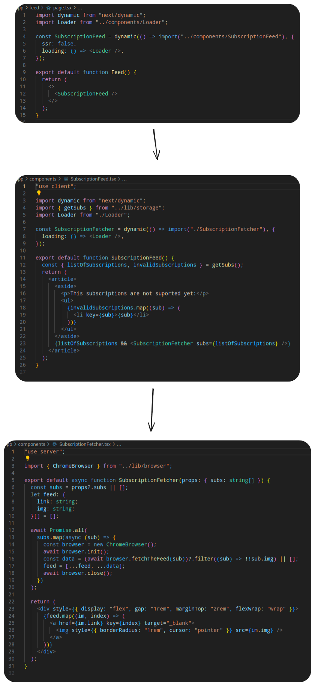

This is a [Next.js](https://nextjs.org) project bootstrapped with [`create-next-app`](https://nextjs.org/docs/app/api-reference/cli/create-next-app). It has 2 goals.

1. Create proof of concept of a service that allows you to subscribe to a variety of content across the website without having accounts. Because it's just a poc only YouTube somehow works, but it was never about creating a full service but about testing how it could work.
2. Learn more about how SSR works in Next.JS. Because I do web scraping with an actual headless browser and I keep data needed for that in local storage, it turned into a fun exercise where I had to maneuver between SSR and client components.

https://github.com/filipizydorczyk/poc-cross-platform-subscriptions/raw/refs/heads/main/video.mp4

# Concept

The user saves a list of URLs to different feeds (YouTube, Twitter, Instagram etc.) and the app uses them to scrape the content and display it in a single feed. As I mentioned it's just poc so this app obviously does not do that, but it showcases the way it could be done. That is: when we open the feed, the server will open every single page from the list and scrapes the necessary content and returns it to the user.

Main issues:
 - **We need to implement feed fetching for every single service separately:** This is the issue that you could not get rid of, but you could make it less of a problem by adding some way for user to create custom scraping algorithm. This had to be something text based because we wouldn't want to run some unidentified user's code on the server. These algorithms could be share with community if something is not supported officially.
 - **It takes a lot of time to fetch the feed, and it gets longer with every subscription:** It could be fixed by simply caching the response every single hour and returning only cached responses. It would save even more time if the app had multiple users that subscribe to the same URLs. We could cache it once and return the same content to every user that subscribes.

# SSR



This is the fun SSR part. As you can see on the image above, we are using a combination of client and server components. This is why:

1. First we are rendering the page skeleton. I will be by default pre-rendered by server, but `SubscriptionFeed` will be rendered only on the client. It will never be rendered on the server because we specifically told it not to. The reason why we wanted it to be a server component is because it uses local storage, and you can't use it on the server. It's simply not accessible out of the browser.

```js
const SubscriptionFeed = dynamic(() => import("../components/SubscriptionFeed"), {
  ssr: false,
  loading: () => <Loader />,
});

export default function Feed() {
  return (
    <>
      <SubscriptionFeed />
    </>
  );
}
```

2. The `SubscriptionFeed` will load the data from local storage using `getSubs()` hook and pass it to `SubscriptionFetcher` which is the server component now. The reason why it's loaded dynamically because we want to render it only once we fetched `listOfSubscriptions`. Since the cost of rendering this component is high, we want to only render it once we have a list we want to display.

```js
"use client";

const SubscriptionFetcher = dynamic(() => import("./SubscriptionFetcher"), {
  loading: () => <Loader />,
});

export default function SubscriptionFeed() {
  const { listOfSubscriptions, invalidSubscriptions } = getSubs();
  return (
    <article>
      <aside>
        <p>This subscriptions are not suported yet:</p>
        <ul>
          {invalidSubscriptions.map((sub) => (
            <li key={sub}>{sub}</li>
          ))}
        </ul>
      </aside>
      {listOfSubscriptions && <SubscriptionFetcher subs={listOfSubscriptions} />}
    </article>
  );
}
```

3. Then we have `SubscriptionFetcher`. This will iterate through the list provided by the client, do the web scraping part and render the feed view. The reason why it has to be server side component is because we are running headless Chrome to do the scraping, and it can't work in the browser. It has to be done on the server, therefore it needs to be server component rendered only when we have necessary data ready.

```js
"use server";

import { ChromeBrowser } from "../lib/browser";

export default async function SubscriptionFetcher(props: { subs: string[] }) {
  const subs = props?.subs || [];
  let feed: {
    link: string;
    img: string;
  }[] = [];

  await Promise.all(
    subs.map(async (sub) => {
      const browser = new ChromeBrowser();
      await browser.init();
      const data = (await browser.fetchTheFeed(sub))?.filter((sub) => !!sub.img) || [];
      feed = [...feed, ...data];
      await browser.close();
    })
  );

  return (
    <div style={{ display: "flex", gap: "1rem", marginTop: "2rem", flexWrap: "wrap" }}>
      {feed.map((im, index) => (
        <a href={im.link} key={index} target="_blank">
          
        </a>
      ))}
    </div>
  );
}
```

# Development

```bash
npm run dev
# or
yarn dev
# or
pnpm dev
# or
bun dev
```
